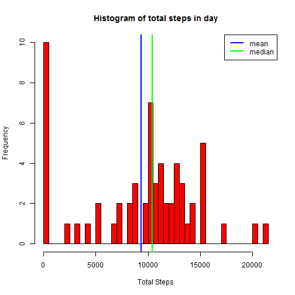
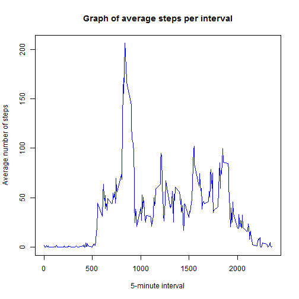
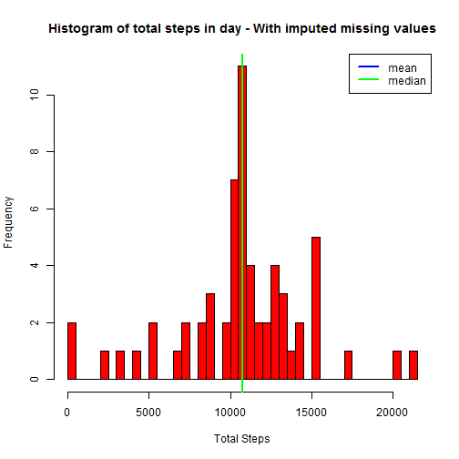

This report contains all the required information for "Peer Assessment 1" assignment.  
The raw data was downloaded from <https://d396qusza40orc.cloudfront.net/repdata%2Fdata%2Factivity.zip>.  
**The raw data has to be in the *work directory***  

The variables included in this dataset are:  
* **steps**: Number of steps taking in a 5-minute interval (missing values are coded as NA)  
* **date**: The date on which the measurement was taken in YYYY-MM-DD format  
* **interval**: Identifier for the 5-minute interval in which measurement was taken  

## Loading, preprocessing the data and analysis

First I will unzip and load the data.

```r
library(dplyr)
library(ggplot2)
unzip("activity.zip")
data <- read.csv("activity.csv")
```
  
Calculate number of total steps for each day and plot an histogram (I have chosen to break the histogram to 50 bins to get good resolution):

```r
sumByDate <- summarise(group_by(data,date),TotalSteps = sum(steps,na.rm = TRUE))

hist(sumByDate$TotalSteps,breaks = 50, 
     col="red",
     main = paste("Histogram of total steps in day"), 
     xlab = "Total Steps")
abline(v=mean(sumByDate$TotalSteps),col="blue",lwd=2)
abline(v=median(sumByDate$TotalSteps),col="green",lwd=2)
legend("topright",
        c("mean","median"),
        lty=c(1,1),
        lwd=c(2.5,2.5),col=c("blue","green"))
```

 
  
The mean and median of the total number of steps were calculated as following:

```r
mean(sumByDate$TotalSteps)
```

```
## [1] 9354.23
```

```r
median(sumByDate$TotalSteps)
```

```
## [1] 10395
```
  

In this part we were required to plot an average of steps taken as function of 5-minute intervals.
Therefore, I will first group the data by 5-minute invervals and then calculate an average per interval.

```r
averageByInterval <- summarise(group_by(data,interval),average = mean(steps,na.rm = TRUE))
```
  
The 5-minute interval in which the average of total steps is maximal is:

```r
averageByInterval$interval[which.max(averageByInterval$average)]
```

```
## [1] 835
```
  
Using the calculated data we will plot the average number of steps per 5-minute interval

```r
plot(averageByInterval$interval,averageByInterval$average,type="l",
     main = "Graph of average steps per interval",
     xlab = "5-minute interval", ylab = "Average number of steps",
     col="blue")
```

 
  
As requested, number of rows containing "NA" is given by:

```r
sum(is.na(data$steps))
```

```
## [1] 2304
```
  
## Imputing missing values
  
The imputation rule is :  
Replacement of NAs with the average of number of steps for the relevant 5-minute interval.  
**dataImputed** is the variable name that will hold the same data holded in original table **data** but with imputed missing values

```r
dataImputed <- data
naIndices <- which(is.na(data$steps))
for (i in naIndices) {
    dataImputed[i,"steps"] = averageByInterval[which(averageByInterval$interval == data[i,"interval"]),"average"]
}
```
  
Now let's repeat the plots and calculations on the new data (with imputed missing values):

```r
sumByDateImputed <- summarise(group_by(dataImputed,date),TotalSteps = sum(steps,na.rm = TRUE))

hist(sumByDateImputed$TotalSteps,breaks = 50, 
     main = paste("Histogram of total steps in day - With imputed missing values"), 
     xlab = "Total Steps",
     col="red")
abline(v=mean(sumByDateImputed$TotalSteps),col="blue",lwd=2)
abline(v=median(sumByDateImputed$TotalSteps),col="green",lwd=2)
legend("topright",
        c("mean","median"),
        lty=c(1,1),
        lwd=c(2.5,2.5),col=c("blue","green"))
```

 
  
The mean and median on the data with the imputed missing values were calculated as following:

```r
mean(sumByDateImputed$TotalSteps)
```

```
## [1] 10766.19
```

```r
median(sumByDateImputed$TotalSteps)
```

```
## [1] 10766.19
```
  
  
Results comparison:

data type|   mean    |   median
---------|-----------|----------
original |   9354.2295082     |  10395
imputed  |   1.0766189 &times; 10<sup>4</sup>     |  1.0766189 &times; 10<sup>4</sup>

According to the results in the comparison table presented above we can see that imputation of the missing values caused two modifications:  
1. The mean value was changed  
2. The mean and median values got equal (due to the type of imputing that was picked)
  
## Presentation as function of day type

I will create a new variable that is a replicate of the data with imputed missing values.  
Then add a new column called *day_type* that will be *weekend* or *weekday* according to the date.


```r
dataWeekdays <- data
dataWeekdays[,"day_type"] <- rep(0,nrow(dataWeekdays))
dataWeekdays[,"day_type"] <- (weekdays(as.Date(dataWeekdays$date)) == "Saturday") |
                             (weekdays(as.Date(dataWeekdays$date)) == "Sunday")
dataWeekdays[dataWeekdays$day_type == FALSE,"day_type"] <- "weekday"
dataWeekdays[dataWeekdays$day_type == TRUE,"day_type"] <- "weekend"
```
  
At last, I will group the new constructed data by weekday/weekend type and then calculate mean for each of 5-minute intervals:

```r
dataWeekdaysGrouped <- summarise(group_by(dataWeekdays,day_type,interval),average = mean(steps,na.rm = TRUE))
    
qplot(interval,average,data=dataWeekdaysGrouped,geom="line",facets=.~day_type,
      ylab="average number of steps", xlab="5-minute invterval")
```

 
